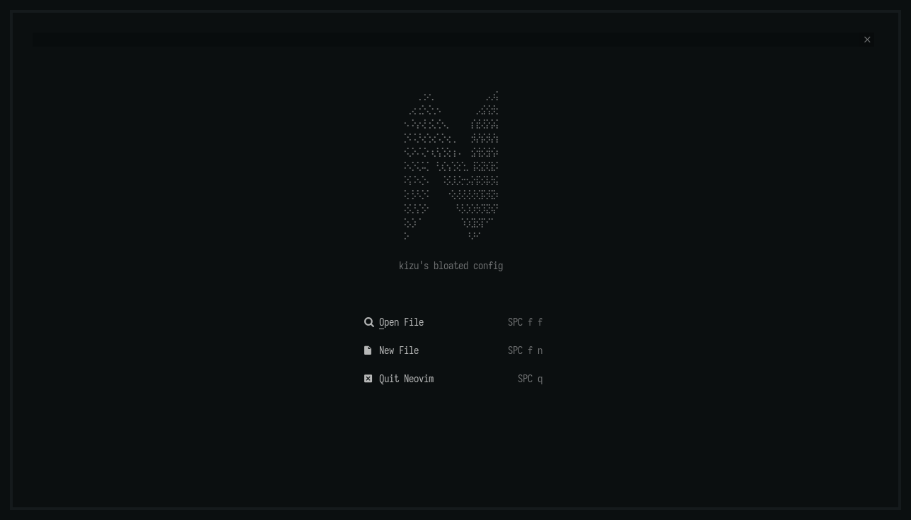
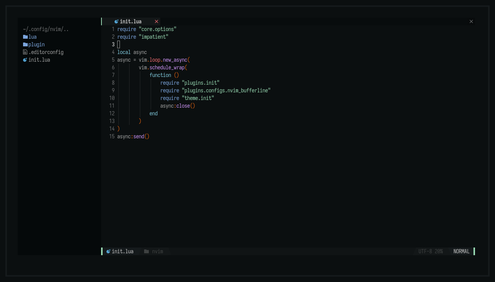
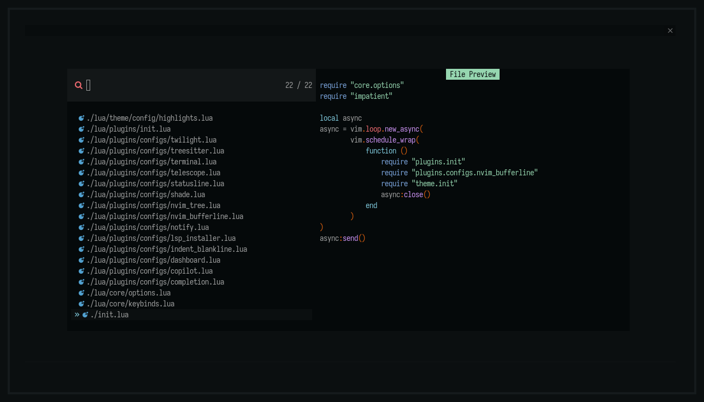
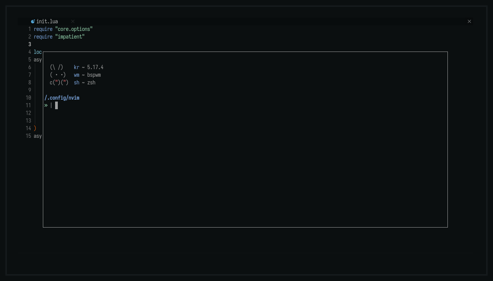

<h2 align="center"> ━━━━━━  ❖  ━━━━━━ </h2>

<div align="center">
   <p></p>
   <a href="">
      
   </a>
   <a href="https://github.com/janleigh/neodots/stargazers">
      
   </a>
   <a href="https://github.com/janleigh/neodots/">
      
   </a>
   <br>
</div>
<div align="center">
   <p></p>
   <a href="https://discord.gg/2RfJb3CVfb">
      
   </a>
   <br>
</div>

## :wrench: <samp>SETUP</samp>

   * First, install [packer.nvim](https://github.com/wbthomason/packer.nvim).
   * Then, clone this repo to `$HOME/.config/nvim`.
   ```
     $ git clone https://github.com/janleigh/neodots $HOME/.config/nvim
   ```
   * Run `nvim +PackerSync`.

## :herb: <samp>KEYBINDS</samp>

   * To be documented. For now, refer to [keybinds.lua](lua/core/keybinds.lua) instead.

## :japan: <samp>GALLERY</samp>

   <details open>
   <summary><strong>Dashboard</strong></summary>

   
   </details>

   <details open>
   <summary><strong>Nvim Tree</strong></summary>

   
   </details>

   <details open>
   <summary><strong>Telescope</strong></summary>

   
   </details>

   <details open>
   <summary><strong>Terminal</strong></summary>

   
   </details>
